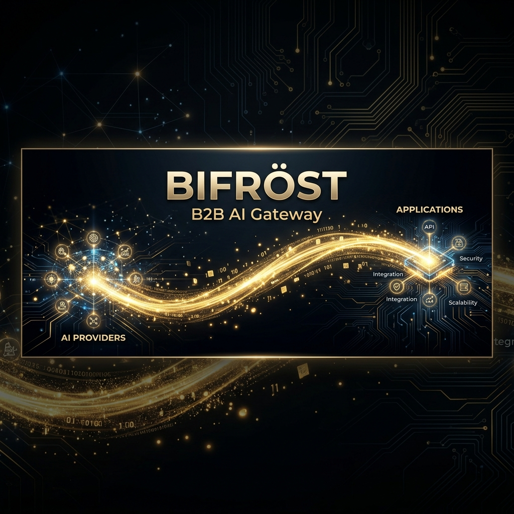
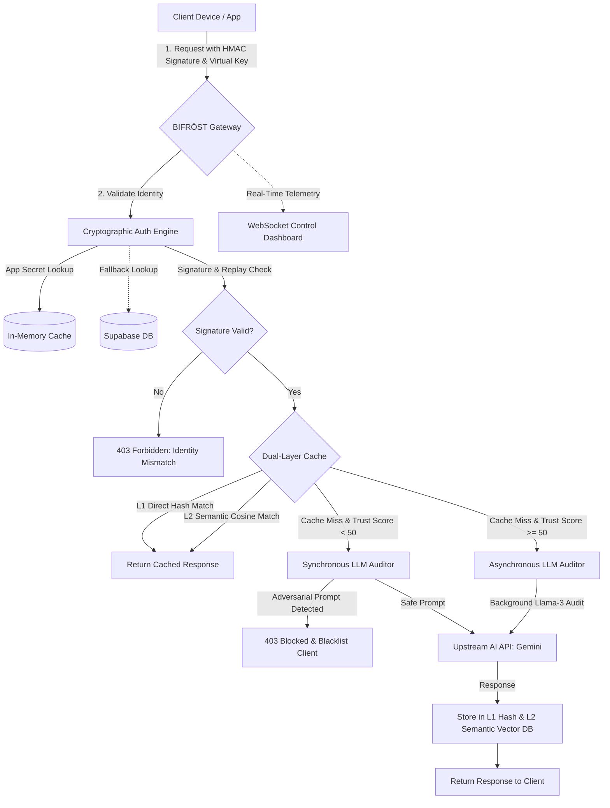

# 🌈 BIFRÖST (Bitfrost) — B2B AI Gateway & Sovereign Proxy
> **High-Performance Multi-Tenant Reverse Proxy, Zero-Trust Cryptographic Gateway & pgvector Semantic Cache for Upstream LLM APIs**

<p align="center">
  
</p>

<p align="center">
  
  
  
  
  
  
</p>

---

## 🧬 Hackathon Project Summary

Bifröst is an **enterprise-grade, zero-trust AI API Gateway and Reverse Proxy** designed for B2B SaaS companies. In modern applications, integrating downstream LLM APIs (like Google Gemini) poses significant risks: credentials exposure, API key rotation headaches, costly token bills, prompt injection attacks, and client identity spoofing. 

Bifröst sits transparently between your client applications and upstream AI models to solve these problems. It secures credentials in a multi-tenant Key Vault, authenticates devices with cryptographic signatures, cuts model token costs by up to **99%** through a dual-layer caching engine, and defends against adversarial prompt injections using Ollama Cloud threat auditing.

---

## 🏗️ System Architecture

Bifröst intercepts, validates, sanitizes, caches, and proxies every prompt before it hits upstream AI providers:



---

## ⚡ Core Engineering Subsystems

### 🔑 1. Multi-Tenant Key Vault
Clients authenticate using generated virtual keys (`bf-vk-...`).
* **Provider Decoupling**: Upstream API keys (e.g. Gemini) are mapped to virtual keys and injected on the fly in incoming request URLs (`?key=REAL_KEY`). Clients never handle real keys.
* **Seamless Hot Rotation**: Rotate underlying provider keys instantly via the backend API without releasing client updates.
* **Dual-Layer Coherence**: Key bindings are synchronized instantly in a local, hot-cached in-memory key-value store, backed by Supabase PostgreSQL for persistent durability.

### 🛡️ 2. Zero-Trust Cryptographic Security
Bifröst completely shields upstream APIs from unauthorized clients.
* **Anti-Replay Attack Protection**: Compares incoming request timestamps (`X-Timestamp`) with server times, rejecting requests outside of a strict 60-second execution window.
* **HMAC-SHA256 Device Fingerprinting**: Every request must be cryptographically signed by the client. The device signature is calculated via:
  $$\text{Signature} = \text{HMAC-SHA256}(\text{app\_secret}, \text{deviceID} + \text{app\_secret} + \text{timestamp})$$
  The gateway recalculates this using the tenant's secret retrieved from the Key Vault, preventing request tampering.
* **Dynamic Device Trust Scoring**: Tracks device health scores (starting at 100). Malicious attempts degrade the score. Devices with a score below 50 are quarantined and audited synchronously.

### 💸 3. Dual-Layer Caching Engine
Bifröst drastically cuts down your LLM inference pricing ($0.075 to $15.00 per 1M tokens) through an intelligent caching system.
* **L1 Direct Hash Cache**: Executes a sub-millisecond SHA-256 hash comparison on the exact prompt body string.
* **L2 Semantic Cache**: Translates prompt semantics using Google's `gemini-embedding-001` and evaluates them using a **Cosine Similarity threshold of $\ge 0.88$**.
  $$\text{Cosine Similarity} = \frac{\mathbf{A} \cdot \mathbf{B}}{\|\mathbf{A}\|_2 \|\mathbf{B}\|_2} = \frac{\sum_{i=1}^{n} A_i B_i}{\sqrt{\sum_{i=1}^{n} A_i^2} \sqrt{\sum_{i=1}^{n} B_i^2}}$$
* **Tenant Isolation**: Caches are partitioned per tenant/company, ensuring absolute compliance and data privacy between clients.
* **Savings Tracking**: Automatically parsing prompt and generation tokens, calculating savings dynamically based on input/output pricing, and outputting to dashboards.

### 🧠 4. Dynamic LLM Interception & Threat Auditing
Shields models from malicious direct jailbreaks, prompt injections, and system overrides.
* **Dynamic Auditing Isolation**: Safe devices (trust score $\ge 50$) trigger asynchronous auditing to maintain ultra-low latency, while suspect devices (trust score $< 50$) undergo strict, synchronous validation.
* **Ollama Cloud Auditor**: Integrates a secondary model (such as `llama3`) running system audits to identify instruction manipulations, blacklisting malicious client IDs for 24 hours.
* **Self-Healing Circuit Breaker**: If the threat auditor experiences temporary downtime, the circuit breaker opens, redirecting client flows without blocking mission-critical services.

### 🔌 5. Model Context Protocol (MCP) Integration
Bifröst includes native MCP support to handle dynamic permissions:
* Clients can request quota increases dynamically via the `/mcp` endpoint using MCP payloads.
* The gateway checks the client device's trust score. If the score is $\ge 80$, the quota increase is instantly approved and rate limits are adjusted dynamically.

### 📊 6. Real-Time WS Control Plane
Includes a Next.js control panel and a WebSocket server broadcasting telemetry:
* Real-time network latency (in microseconds).
* Aggregated monetary savings in USD.
* Live security events including fingerprint failures, quarantine statuses, and dynamic model control adjustments.

---

## 📦 Repository Directory Structure

This monorepo compiles all components of the Bifröst B2B AI Gateway project:

```
Bitfrost/ (Monorepo Root)
├── backend/       (Sovereign Proxy Data Plane in Go)
│   ├── go.mod
│   ├── go.sum
│   ├── main.go    (Core reverse proxy, cache, security, and WS logic)
│   └── README.md  (Backend documentation)
├── dashboard/     (Control Plane Control Panel in Next.js 15)
│   ├── src/       (TypeScript app components and layout)
│   ├── public/    (Asset files)
│   └── README.md  (Dashboard documentation)
├── gateway/       (Showcase & Deployment Configuration)
│   ├── docs/      (Diagrams and images)
│   ├── supabase-setup.sql   (Database schema for Supabase pgvector)
│   ├── backend.env.example  (Backend environment template)
│   └── dashboard.env.example (Dashboard environment template)
└── README.md      (This file)
```

---

## 🚀 Complete Setup & Deployment Guide

### Step 1: Set Up Supabase Database (with pgvector)

1. Create a new project at [supabase.com](https://supabase.com).
2. Go to **SQL Editor** → **New Query** and run the schema script located in [gateway/supabase-setup.sql](file:///c:/Users/ANSH/.gemini/antigravity/scratch/bifrost/gateway/supabase-setup.sql):
   ```sql
   -- Enable the vector extension for semantic matching
   CREATE EXTENSION IF NOT EXISTS vector;
   -- Creates cache tables and policy functions...
   ```
3. Go to **Settings** → **API** and note down:
   - `Project URL`
   - `anon` public key
   - `service_role` secret key

---

### Step 2: Configure & Run the Go Backend

1. Navigate to the `backend/` directory:
   ```bash
   cd backend
   ```
2. Create your `.env` file based on [gateway/backend.env.example](file:///c:/Users/ANSH/.gemini/antigravity/scratch/bifrost/gateway/backend.env.example):
   ```ini
   GEMINI_API_KEY=AIzaSy...               # Google AI Studio API key
   OLLAMA_API_KEY=your_ollama_key_here    # Ollama Cloud API key for audits
   SUPABASE_URL=https://xxxx.supabase.co  # Supabase URL
   SUPABASE_SERVICE_ROLE_KEY=ey...       # Supabase service role secret
   PORT=8080                              # Local port
   ```
3. Build and run the server:
   ```bash
   go build -o proxy.exe
   ./proxy.exe
   ```
   The backend service starts on `http://localhost:8080`.

---

### Step 3: Configure & Run the Dashboard

1. Navigate to the `dashboard/` directory:
   ```bash
   cd ../dashboard
   ```
2. Create your `.env.local` file based on [gateway/dashboard.env.example](file:///c:/Users/ANSH/.gemini/antigravity/scratch/bifrost/gateway/dashboard.env.example):
   ```ini
   NEXT_PUBLIC_SUPABASE_URL=https://xxxx.supabase.co
   NEXT_PUBLIC_SUPABASE_ANON_KEY=ey...
   NEXT_PUBLIC_PROXY_URL=http://localhost:8080
   ```
3. Install dependencies and start the Next.js development server:
   ```bash
   npm install
   npm run dev
   ```
   Open `http://localhost:3000` to access the Control Plane Dashboard.

---

### Step 4: Interact & Send Secure Requests

1. Open your dashboard (`http://localhost:3000`) and register/login.
2. Go to **Key Vault** → Enter your real provider key (Gemini API Key) → Click **Forge Virtual Key**.
3. Note down the generated `Virtual Key` (starts with `bf-vk-...`) and the `App Secret` (starts with `sec-...`).
4. Execute requests through the proxy with cryptographic signatures using `cURL`:
   ```bash
   # Parameters
   DEVICE_ID="device-001"
   TIMESTAMP=$(date +%s)
   APP_SECRET="sec-your-app-secret-here"
   VIRTUAL_KEY="bf-vk-your-virtual-key-here"

   # Create HMAC signature
   MESSAGE="${DEVICE_ID}${APP_SECRET}${TIMESTAMP}"
   FINGERPRINT=$(echo -n "$MESSAGE" | openssl dgst -sha256 -hmac "$APP_SECRET" | awk '{print $2}')

   # Route through the gateway proxy
   curl -X POST "http://localhost:8080/v1beta/models/gemini-2.0-flash:generateContent" \
     -H "Content-Type: application/json" \
     -H "X-Bifrost-Key: $VIRTUAL_KEY" \
     -H "X-Device-ID: $DEVICE_ID" \
     -H "X-Timestamp: $TIMESTAMP" \
     -H "X-Device-Fingerprint: $FINGERPRINT" \
     -d '{"contents": [{"parts": [{"text": "What is semantic caching?"}]}]}'
   ```
5. **Observe Cache Hit & Savings**: Send the same request a second time. The response is returned instantly (zero latency) with the header `X-Bifrost-Cache: DIRECT` (or `SEMANTIC` for similar queries). The savings will tick up on your dashboard!

---

## 🔒 Security Specifications

* **Replay Protection**: The `X-Timestamp` header is evaluated against the server's current epoch. Any request that falls outside of the $\pm 60$ seconds execution window is rejected instantly with `403 Forbidden` to prevent man-in-the-middle replay attacks.
* **Payload Size Limits**: Limits payload ingestion to `2MB` (`MaxBodySize`) to block Denial of Service (DoS) attempts via bloated prompt payloads.
* **Circuit Breaker Status**: If Ollama Cloud times out or fails 5 consecutive times, the Circuit Breaker opens for 60 seconds, allowing prompt traffic to proceed safely to Gemini without security blocking to preserve B2B application availability.
