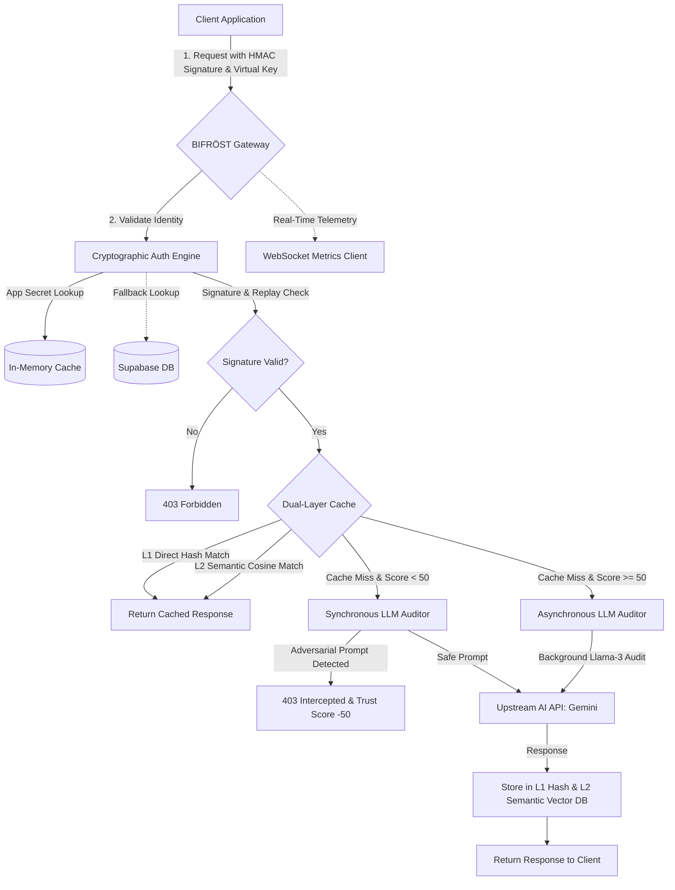

# BIFRÖST Sovereign Proxy 🌈
> **High-Performance Multi-Tenant Reverse Proxy & Cryptographic Gateway for LLM APIs**

Bifröst is an enterprise-grade sovereign proxy written in Go, acting as a secure, high-performance, and cost-optimizing gateway between your client devices and Generative AI upstream services (e.g., Google Gemini). 

Designed under a zero-trust model, Bifröst features a **multi-tenant Key Vault** to eliminate provider api-key exposures, implements **cryptographic identity verification** to defeat replay and identity spoofing attacks, utilizes an **intelligent dual-layer caching engine** (L1 direct & L2 semantic caching) to cut model token costs by up to 99%, and runs **autonomous threat auditing** to intercept adversarial prompt-injection vectors.

---

## 🏗️ System Architecture

Bifröst intercepts, verifies, audits, and optimizes every incoming prompt before it touches downstream AI models.



---

## ⚡ Core Subsystems & Features

### 🔑 1. Multi-Tenant Key Vault
Keeps your upstream API credentials secure and centered behind server walls. Clients authenticate using generated virtual keys (`bf-vk-...`).
* **Provider Decoupling**: Upstream keys are mapped to virtual keys and injected on the fly in incoming request URLs (`?key=REAL_KEY`).
* **Hot Key Rotation**: Rotate underlying provider keys instantly without updating client applications.
* **Database Coherence**: Automatically syncs bindings with a local in-memory store, using Supabase as a durable fallback layer.

### 🛡️ 2. Cryptographic Zero-Trust Security
Bifröst completely guards APIs from malicious unauthorized endpoints and API key theft.
* **Anti-Replay Attack Protection**: Compares incoming request timestamps (`X-Timestamp`) with server times, rejecting requests outside of a strict 60-second execution window.
* **HMAC-SHA256 Fingerprinting**: Generates and validates requests using standard cryptographic signatures. A device signature is generated via:
  $$\text{Signature} = \text{HMAC-SHA256}(\text{app\_secret}, \text{deviceID} + \text{app\_secret} + \text{timestamp})$$
* **Device Trust Scoring**: Dynamically tracks client health scores (starting at 100). Malicious attempts degrade the score. Devices with a score below 50 are quarantined and audited synchronously.

### 💸 3. Dual-Layer Caching Engine
Bifröst drastically cuts down your LLM inference pricing ($0.075 to $15.00 per 1M tokens) through an intelligent L1 and L2 cache system.
* **L1 Direct Hash Cache**: Executes a lightning-fast SHA-256 hash comparison on the exact prompt body string.
* **L2 Semantic Cache**: Translates prompt semantics using Google's `gemini-embedding-001` and evaluates them using a **Cosine Similarity threshold of $\ge 0.88$**.
* **Tenant Isolation**: Caches are partitioned per tenant/company, ensuring absolute compliance and data privacy between clients.
* **Savings Tracking**: Automatically parsing prompt and generation tokens, calculating savings dynamically based on input/output pricing, and outputting to dashboards.

### 🧠 4. Dynamic LLM Interception & Threat Auditing
Shields models from malicious direct jailbreaks, prompt injections, and system overrides.
* **Dynamic Auditing Isolation**: Safe devices (trust score $\ge 50$) trigger asynchronous auditing to maintain ultra-low latency, while suspect devices (trust score $< 50$) undergo strict, synchronous validation.
* **Ollama Cloud Auditor**: Integrates a local/cloud-based secondary model (such as `llama3`) running system audits to identify instruction manipulations, blacklisting malicious client IDs for 24 hours.
* **Self-Healing Circuit Breaker**: If the threat auditor experiences temporary downtime, the circuit breaker opens, redirecting client flows without blocking mission-critical services.

### 📡 5. Real-Time WS Diagnostics Hub
Bifröst includes a WebSocket server (`/ws/metrics`) broadcasting telemetry:
* Real-time network latency (in microseconds).
* Aggregated monetary savings in USD.
* Live security events including fingerprint failures, quarantine statuses, and dynamic model control adjustments.

---

## 🛢️ Database Schema Configuration

To run Bifröst in permanent Multi-Tenant production mode, apply the following SQL DDL scripts to your Supabase PostgreSQL instance:

```sql
-- Enable the vector extension for semantic matching
CREATE EXTENSION IF NOT EXISTS vector;

-- 1. Table for Virtual Key bindings
CREATE TABLE IF NOT EXISTS bifrost_keys (
    virtual_key TEXT PRIMARY KEY,
    company_id TEXT NOT NULL,
    real_key TEXT NOT NULL,
    app_secret TEXT NOT NULL,
    created_at TIMESTAMPTZ DEFAULT NOW()
);

-- 2. Table for Dual-Layer Caching
CREATE TABLE IF NOT EXISTS bifrost_cache (
    id BIGSERIAL PRIMARY KEY,
    company_id TEXT NOT NULL,
    prompt_text TEXT NOT NULL,
    prompt_hash TEXT NOT NULL UNIQUE,
    embedding VECTOR(768), -- Gemini Embedding dimension is 768
    response TEXT NOT NULL,
    created_at TIMESTAMPTZ DEFAULT NOW()
);

-- Index for speedy SHA-256 direct hash matching
CREATE INDEX IF NOT EXISTS idx_bifrost_cache_hash ON bifrost_cache (prompt_hash);

-- 3. pgvector Cosine Similarity Match Function
CREATE OR REPLACE FUNCTION match_prompts(
    query_embedding VECTOR(768),
    match_threshold FLOAT,
    match_count INT,
    target_company_id TEXT
)
RETURNS TABLE (
    response TEXT
)
LANGUAGE plpgsql
AS $$
BEGIN
    RETURN QUERY
    SELECT bc.response
    FROM bifrost_cache bc
    WHERE bc.company_id = target_company_id
      AND 1 - (bc.embedding <=> query_embedding) > match_threshold
    ORDER BY bc.embedding <=> query_embedding ASC
    LIMIT match_count;
END;
$$;
```

---

## 🛠️ API & Endpoint Reference

### 1. Generate Virtual Key
Register a tenant company and establish an isolated app secret and virtual key pairing.
* **Endpoint**: `POST /api/keys/generate`
* **Request Body**:
```json
{
  "company_id": "globex-corp",
  "real_key": "AIzaSy..."
}
```
* **Response**:
```json
{
  "virtual_key": "bf-vk-b3fcd7c19a9e3381a179c3fbf2ee13fa",
  "app_secret": "sec-b2e38c92a2a0ee12f5ea11a5cc9a97bc",
  "company_id": "globex-corp"
}
```

### 2. Rotate Real API Key
Swap a tenant's provider API key instantly without breaking client bindings.
* **Endpoint**: `POST /api/keys/rotate`
* **Request Body**:
```json
{
  "virtual_key": "bf-vk-b3fcd7c19a9e3381a179c3fbf2ee13fa",
  "new_real_key": "AIzaSyNewKey..."
}
```
* **Response**:
```json
{
  "status": "rotated"
}
```

### 3. Toggle Tenant Cache Settings
* **Endpoint**: `POST /api/settings/cache`
* **Request Body**:
```json
{
  "company_id": "globex-corp",
  "cache_enabled": false
}
```
* **Response**:
```json
{
  "status": "updated"
}
```

### 4. Model Control Protocol (MCP) Quota Request
Trusted client devices can negotiate high-limit operational bandwidth.
* **Endpoint**: `POST /mcp`
* **Headers**: Cryptographic authentication headers must be included.
* **Request Body**:
```json
{
  "method": "request_quota_increase",
  "reason": "critical_task"
}
```
* **Response**:
```json
{
  "status": "approved",
  "new_limit": 1000,
  "duration_minutes": 5
}
```

### 5. WebSocket Telemetry Stream
Connect a client to view continuous telemetry data.
* **Endpoint**: `GET /ws/metrics`
* **Payload Structure**:
```json
{
  "type": "METRIC",
  "payload": {
    "timestamp": "17:15:30",
    "latency": 2450,
    "savings": 0.45025
  }
}
```

---

## 🔒 Client Cryptographic Header Signature Example

To query the proxy successfully, all client applications must construct their request headers with valid HMAC-SHA256 signature hashes. Here are complete boilerplate snippets:

### Python Implementation
```python
import hmac
import hashlib
import time
import requests

def make_signed_request(proxy_url, prompt, virtual_key, app_secret, device_id):
    timestamp = str(int(time.time()))
    
    # Construct the message string exactly as expected by the proxy
    message = f"{device_id}{app_secret}{timestamp}"
    
    # Calculate signature
    signature = hmac.new(
        app_secret.encode('utf-8'),
        message.encode('utf-8'),
        hashlib.sha256
    ).hexdigest()
    
    headers = {
        "X-Bifrost-Key": virtual_key,
        "X-Device-ID": device_id,
        "X-Timestamp": timestamp,
        "X-Device-Fingerprint": signature,
        "Content-Type": "application/json"
    }
    
    payload = {
        "contents": [{
            "parts": [{"text": prompt}]
        }]
    }
    
    response = requests.post(
        f"{proxy_url}/v1beta/models/gemini-1.5-flash:generateContent",
        headers=headers,
        json=payload
    )
    return response.json()
```

### Node.js Implementation
```javascript
const crypto = require('crypto');

async function sendRequest(proxyUrl, prompt, virtualKey, appSecret, deviceId) {
    const timestamp = Math.floor(Date.now() / 1000).toString();
    const message = `${deviceId}${appSecret}${timestamp}`;
    
    const signature = crypto
        .createHmac('sha256', appSecret)
        .update(message)
        .digest('hex');

    const headers = {
        'X-Bifrost-Key': virtualKey,
        'X-Device-ID': deviceId,
        'X-Timestamp': timestamp,
        'X-Device-Fingerprint': signature,
        'Content-Type': 'application/json'
    };

    const payload = {
        contents: [{
            parts: [{ text: prompt }]
        }]
    };

    const response = await fetch(`${proxyUrl}/v1beta/models/gemini-1.5-flash:generateContent`, {
        method: 'POST',
        headers: headers,
        body: JSON.stringify(payload)
    });
    
    return await response.json();
}
```

---

## 🛠️ Environment Configuration & Deployment

Create a `.env` file in the root directory:

```ini
PORT=8080
GEMINI_API_KEY=AIzaSyYourGeminiKeyHere
OLLAMA_URL=https://api.ollama.ai/v1/generate
OLLAMA_API_KEY=your-ollama-api-key-here

# Supabase Integrations (Optional, falls back to in-memory matching if omitted)
SUPABASE_URL=https://your-project.supabase.co
SUPABASE_SERVICE_ROLE_KEY=your-supabase-service-role-key-here
```

### Build & Run
Ensure you have Go installed, then execute:

```bash
# Get dependencies
go mod tidy

# Run the proxy locally
go run main.go
```

To compile a highly optimized binary:
```bash
# Build optimized native binary
go build -ldflags="-w -s" -o bifrost-proxy main.go
```

---

## 🏛️ License
Bifröst is open-source software, licensed under the MIT License.
