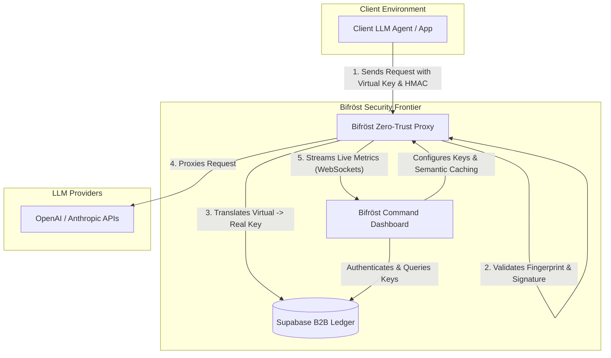

# 🌌 Bifröst Command

[](https://nextjs.org/)
[](https://react.dev/)
[](https://tailwindcss.com/)
[](https://supabase.com/)
[](https://opensource.org/licenses/MIT)

> **Sovereign Multi-Tenant Control Panel & Telemetry Command Center for the Bifröst Zero-Trust AI Proxy.**

---

## 📖 Overview

**Bifröst Command** is the high-fidelity B2B enterprise control panel for the **Bifröst Zero-Trust AI Proxy**. Built under the luxurious, high-contrast **Lumivelle Design Language** (featuring an obsidian base with refined gold accents and tactile borders), it provides real-time telemetry, advanced cryptographic key forging, live zero-trust audit feeds, and hot-swappable AI API key management.

Through sovereign multi-tenant isolation, enterprise administrators can monitor, secure, and optimize their organization’s interaction with Large Language Models (LLMs) and Model Context Protocol (MCP) servers under a zero-trust model.

---

## 🏛️ System Architecture

The following diagram illustrates how the **Bifröst Command Dashboard** orchestrates communication between corporate client agents, the **Bifröst Zero-Trust Proxy**, the database ledger, and downstream AI providers:



---

## ⚡ Core Telemetry & Subsystems

### 1. 📈 The Pulse (Global Latency Telemetry)
* **Description**: Real-time microsecond-level (`μs`) visualizer tracking execution latency across the entire gateway.
* **Mechanism**: Native, low-overhead WebSockets streaming via `wss://bifrost-proxy/ws/metrics` displaying a reactive step-area Recharts graph.

### 2. 🧠 The Semantic Brain (Savings Monitor)
* **Description**: Live tracking of direct enterprise financial savings accrued by routing redundant LLM completions to the proxy's local **Semantic Cache**.
* **Control**: Sovereign toggle to hot-swap the Semantic Brain state (`ONLINE`/`OFFLINE`) dynamically across proxy environments.

### 3. 🛡️ The Sentry (Zero-Trust Feed)
* **Description**: Continuous monitoring feed evaluating incoming traffic.
* **States Logged**:
  * `VALID`: Trusted corporate client agent.
  * `QUARANTINE`: Suspicious client configuration or mismatched device signature.
  * `BLOCKED`: Blocked attempt to call LLM APIs without valid virtual credentials.

### 4. 🤝 The Negotiator (Model Context Protocol Feed)
* **Description**: Real-time security ledger logging agent tool execution and file/command requests.
* **Action Logs**: Automatically captures tools, execution contexts, and device states, enforcing rapid audit visibility into `APPROVED` and `DENIED` actions.

### 5. 🔑 The Sovereign Vault (Key Forging & Rotation)
* **Description**: B2B Tenant-Isolated Virtual Key Forge.
* **Features**:
  * **Virtual Mappings**: Maps standard provider keys (e.g., `sk-proj-...`) into local, zero-trust `X-Bifrost-Key` tokens.
  * **HMAC Secrets**: Forges cryptographically secure app secrets for sign-and-verify security policies.
  * **Zero-Downtime Hot Rotation**: Rotate the underlying downstream API key instantly without modifying client applications.

---

## 🛠️ Technology Stack

| Component | Technology | Rationale |
| :--- | :--- | :--- |
| **Framework** | [Next.js 16](https://nextjs.org/) + [React 19](https://react.dev/) | Premium Server-Side Rendering & Client Hydration. |
| **Styling** | [Tailwind CSS v4](https://tailwindcss.com/) | Theme-first layout control utilizing Obsidian-Gold color tokens. |
| **Database & Auth** | [Supabase](https://supabase.com/) | Row-Level Security (RLS) policies protecting tenant-isolated tables. |
| **Icons** | [Lucide React](https://lucide.dev/) | Consistent, clean visual cues across control grids. |
| **Charts** | [Recharts](https://recharts.org/) | Responsive, hardware-accelerated SVG graphs. |
| **Real-time Engine** | Native WebSockets | Constant, stutter-free telemetry data loop. |

---

## ⚙️ Environment Configuration

To configure the dashboard, create a `.env.local` file in the root directory:

```env
# Supabase Integration (Auth & Key Ledger)
NEXT_PUBLIC_SUPABASE_URL=https://your-project.supabase.co
NEXT_PUBLIC_SUPABASE_ANON_KEY=your-anon-key-here

# Bifröst Zero-Trust Proxy Endpoint
NEXT_PUBLIC_PROXY_URL=http://localhost:8080
```

---

## 🚀 Getting Started

### Prerequisites
- Node.js **18.17.0** or higher
- npm, yarn, pnpm, or bun

### 1. Installation
Clone the repository and install the project dependencies:
```bash
git clone https://github.com/Anshsurana123/bifrost-dashboard.git
cd bifrost-dashboard
npm install
```

### 2. Run the Development Server
Execute the command line below to boot up the environment locally:
```bash
npm run dev
```
Open [http://localhost:3000](http://localhost:3000) with your browser to configure, monitor, and access your command telemetry.

### 3. Build for Production
To generate a production-optimized build of the dashboard:
```bash
npm run build
npm run start
```

---

## 📂 Project Structure

```text
dashboard/
├── public/                # Static assets and icons
└── src/
    ├── app/
    │   ├── globals.css    # Tailwind 4 theme definition & Obsidian base styling
    │   ├── layout.tsx     # Base viewport and HTML structure
    │   └── page.tsx       # Core Command Panel dashboard & sovereign authentication
    ├── hooks/
    │   └── useMetrics.ts  # Real-time WebSocket hook streaming telemetry, logs, and audit data
    └── lib/
        └── supabase.ts    # Initialized Supabase client with tenant database boundaries
```

---

## 🔒 Security Policies

- **Sovereign Multi-Tenant Isolation**: Row-Level Security (RLS) in the Supabase ledger prevents tenants from listing, modifying, or rotating virtual keys belonging to other companies.
- **Zero-Exposure Tokens**: Downstream provider keys (e.g. OpenAI `sk-...`) are stored as salted, encrypted strings and never exposed in cleartext to client devices.
- **Micro-Agent Fingerprinting**: All device keys enforce continuous handshake check-ins, allowing the **Sentry** to instantly quarantine suspicious agent processes.

---

## 📄 License

Distributed under the MIT License. See `LICENSE` for more information.

---

<div align="center">
  <p>Forged with precision. Designed for secure intelligence. 🌌 <b>Bifröst Proxy Ecosystem</b>.</p>
</div>
